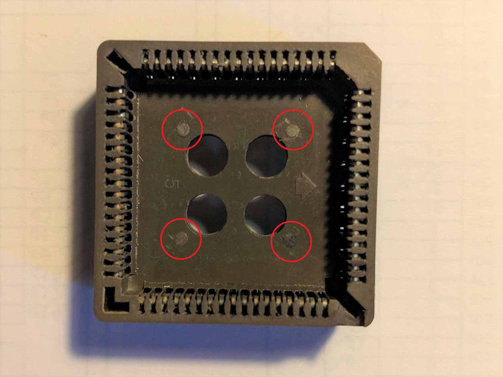
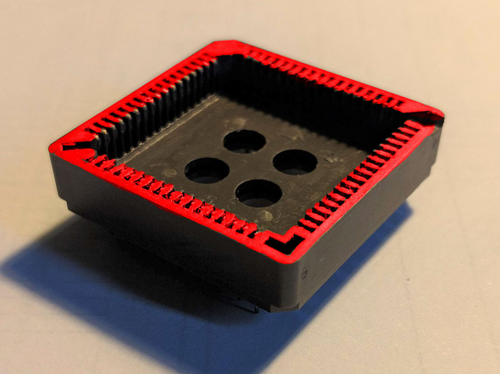
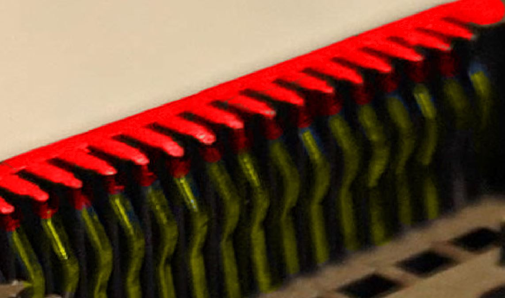
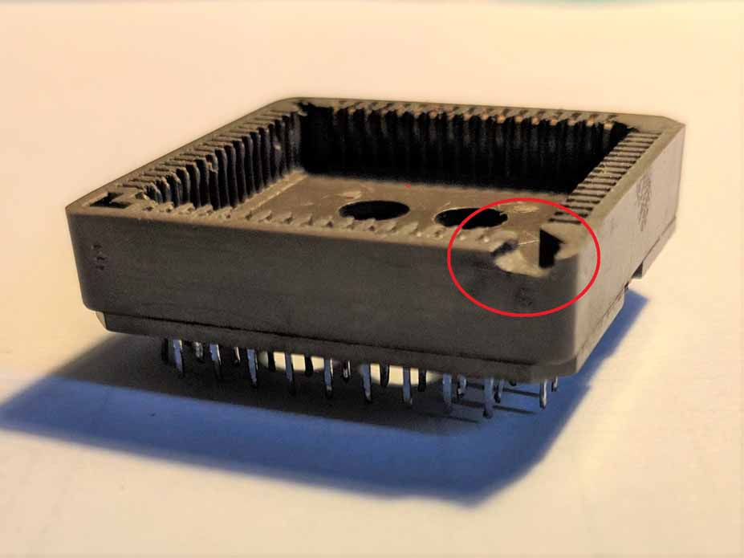
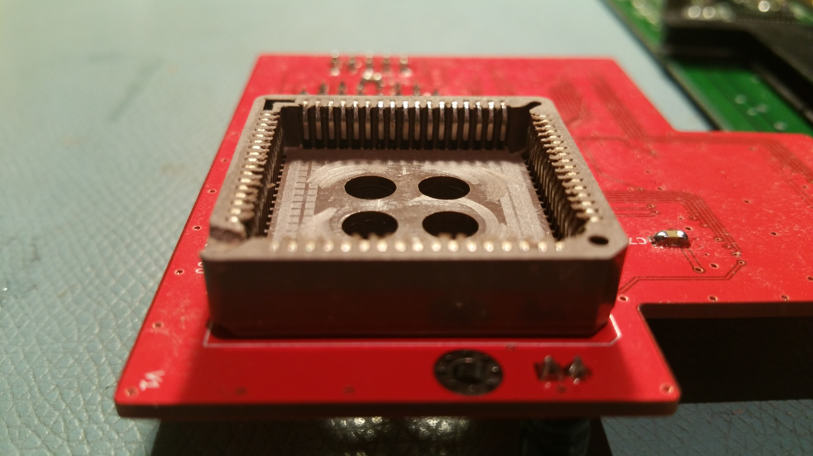

# PLCC Socket Rework
The hardest thing to achieve when assembling an OpenAmiga600FastRamExpansion is a good fit on the CPU for the PLCC socket.

Some people recommend using an [Augat PCS-068A](https://octopart.com/search?q=PCS-068A) socket, as apparently it's the one used on Furia cards, which admittedly fit very well on the CPU.

Anyway, whatever socket you use, it won't fit very well as-is, since we're using it differently to how it was designed. You can get a much better fit if you sand its surface down until it is level with the tips of the metal pins. This allows it to sit lower on the 68000 and grip the pins better.

## Rework Procedure
1. Remove the small nubs (highlighted in red) from the inside of the socket so that the inner of the socket is totally flat.
   
   

2. Put a sheet of sandpaper on a table and rub the socket on it until the edge of the socket (highlighted in red) is level with the tips of the internal metal pins (highlighted in yellow). Only ~0.5mm to ~1mm usually needs removing depending on the socket.
   
   
   

3. File out a small notch in the corner of the socket to allow for socket to sit over the `R102` SMD resistor on the motherboard. Make sure to choose the right corner, maybe try to fit it on the CPU (the large square chip with *MC68000* written on it) and see which one it is. Make sure to match the correct orientation: one of the corners of the chip is "cut" and, if you look at the socket, one of its corners will match that.

   

Hopefully your socket will now have a better fit!

*(Thanks to users Lemaru and katarakt of the EAB forum for these hints)*
